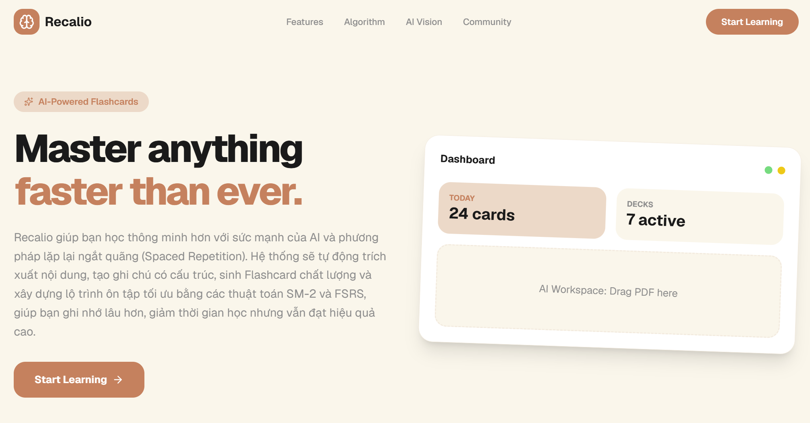
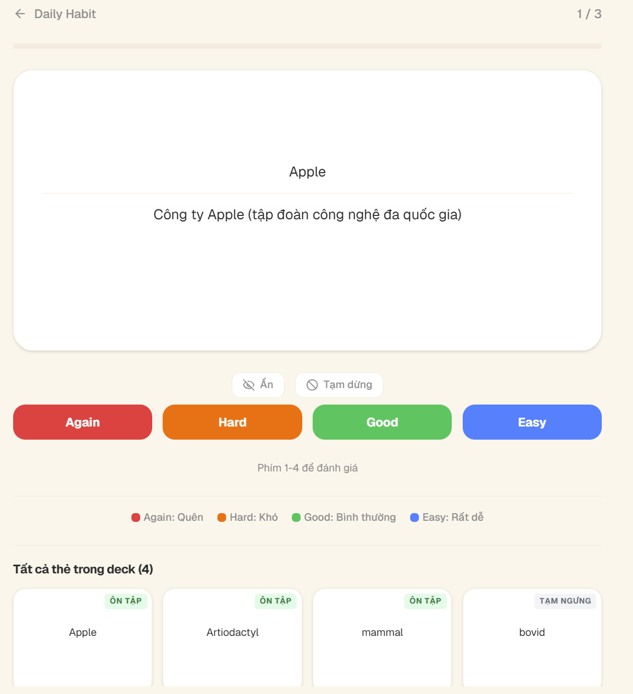

<div align="center">

# 📚 RECALIO

### *A Modern Spaced Repetition Flashcard Platform*

[](https://nextjs.org/)
[](https://reactjs.org/)
[](https://www.typescriptlang.org/)
[](https://tailwindcss.com/)
RECALIO là nền tảng học từ vựng sử dụng thuật toán lặp lại ngắt quãng (Spaced Repetition — SM-2 / FSRS), cho phép người dùng tạo bộ thẻ, ôn tập theo lịch trình thông minh, và theo dõi tiến trình học tập. Hệ thống hỗ trợ nhiều loại mẫu thẻ (Basic, Basic Reversed, Cloze, Image Occlusion), tích hợp AI để sinh nội dung tự động (từ văn bản, chủ đề, hình ảnh), nhập liệu từ PDF và CSV, cùng cơ chế ôn tập dạng gõ đáp án (type-answer).

</div>

<div align="center">

</div>

---

## 📋 Mục lục

- [✨ Tính năng](#-tính-năng)
- [🛠️ Công nghệ sử dụng](#️-công-nghệ-sử-dụng)
- [📁 Cấu trúc dự án](#-cấu-trúc-dự-án)
- [🚀 Cài đặt & Chạy dự án](#-cài-đặt--chạy-dự-án)
- [⚙️ Biến môi trường](#️-biến-môi-trường)
- [📄 Các trang chính](#-các-trang-chính)
- [🔐 Xác thực & Phân quyền](#-xác-thực--phân-quyền)

---

## ✨ Tính năng

- 🗂️ **Quản lý bộ thẻ** – Tạo, clone, chia sẻ bộ thẻ công khai hoặc riêng tư
- 📝 **Tạo note thủ công** – Nhập từ vựng trực tiếp với đầy đủ ngữ nghĩa, IPA, loại từ, ví dụ
- 🤖 **AI sinh nội dung** – Tạo từ vựng tự động từ văn bản, chủ đề hoặc hình ảnh (AI Image Detection)
- 📄 **Import từ PDF** – Upload tài liệu, AI trích xuất và tạo note hàng loạt
- 📊 **Import CSV** – Nhập danh sách từ vựng từ file CSV với papaparse
- 🔄 **SM-2 / FSRS Ôn tập thông minh** – Hai thuật toán lặp lại ngắt quãng, cấu hình linh hoạt theo từng deck
- ⌨️ **Type-answer** – Ôn tập dạng gõ đáp án (hỗ trợ `{{type:field}}` trong mọi template)
- 🔀 **Basic Reversed** – Mẫu thẻ tự động tạo chiều ngược lại
- 🔤 **Cloze** – Mẫu thẻ điền khuyết với cloze editor trực quan
- 🖼️ **Image Occlusion** – Tạo thẻ che/mở hình ảnh bằng SVG overlay, hỗ trợ nhóm occlusion
- 🖼️ **Hỗ trợ hình ảnh & âm thanh** – Hiển thị ảnh và phát audio ngay trên thẻ
- 📈 **Thống kê học tập** – Biểu đồ phân bố đánh giá, lịch sử phiên ôn tập
- 🏆 **Thành tích & Gamification** – Huy hiệu, điểm kinh nghiệm, bảng xếp hạng
- 👥 **Cộng đồng** – Chia sẻ bộ thẻ, theo dõi người dùng, bình luận và đánh giá
- 🛡️ **Bảng quản trị (Admin)** – Quản lý người dùng, bộ thẻ, báo cáo, mẫu thẻ, thành tích
- 🔔 **Thông báo** – Nhắc nhở ôn tập qua email và in-app

---

## 🛠️ Công nghệ sử dụng

| Công nghệ | Phiên bản | Mô tả |
|---|---|---|
| [Next.js](https://nextjs.org/) | 16+ | Framework React với App Router |
| [React](https://reactjs.org/) | 19 | UI Library |
| [TypeScript](https://www.typescriptlang.org/) | 5+ | Type-safe JavaScript |
| [TailwindCSS](https://tailwindcss.com/) | 4 | Utility-first CSS framework |
| [TanStack Query](https://tanstack.com/query) | 5 | Server state & caching |
| [TanStack Table](https://tanstack.com/table) | 8 | Data table (admin panels) |
| [Zustand](https://zustand-demo.pmnd.rs/) | 5 | Lightweight state management (auth) |
| [Axios](https://axios-http.com/) | 1 | HTTP client với auto-refresh token |
| [Zod](https://zod.dev/) | 4 | Schema validation |
| [shadcn/ui](https://ui.shadcn.com/) | – | UI component system (Radix + Tailwind) |
| [react-hook-form](https://react-hook-form.com/) | 7 | Form management |
| [Swiper](https://swiperjs.com/) | 14 | Touch carousels (featured decks, reviews) |
| [Papaparse](https://www.papaparse.com/) | 5 | CSV parsing |

---

## 📁 Cấu trúc dự án

```
recalio_fe/
├── public/                        # Static assets
├── src/
│   ├── app/                       # Next.js App Router
│   │   ├── (user)/                # Layout nhóm cho người dùng
│   │   │   ├── (home)/            # Trang chủ
│   │   │   ├── community/         # Cộng đồng (bài viết, bình luận)
│   │   │   ├── deck/              # Chi tiết bộ thẻ, tạo note, chỉnh sửa
│   │   │   │   └── [id]/
│   │   │   │       ├── create-notes/  # Tạo note (manual, AI, CSV, PDF)
│   │   │   │       ├── edit-cards/    # Chỉnh sửa thẻ
│   │   │   │       └── note/          # Components cho note
│   │   │   ├── document/          # Upload PDF → AI → tạo note
│   │   │   ├── profile/           # Hồ sơ cá nhân
│   │   │   ├── study/             # Ôn tập
│   │   │   │   ├── [deckId]/      # Phiên ôn tập
│   │   │   │   └── session/[id]/  # Chi tiết phiên học
│   │   │   └── suggestion/        # Gợi ý bộ thẻ
│   │   ├── admin/                 # Bảng quản trị
│   │   │   ├── achievement/       # Quản lý thành tích
│   │   │   ├── deck/              # Quản lý bộ thẻ
│   │   │   ├── deck-report/       # Báo cáo bộ thẻ
│   │   │   ├── notification/      # Quản lý thông báo
│   │   │   ├── overview/          # Dashboard tổng quan
│   │   │   ├── post/              # Quản lý bài viết
│   │   │   ├── suggestion/        # Quản lý gợi ý
│   │   │   └── template/          # Quản lý mẫu thẻ
│   │   ├── auth/                  # Xác thực (login, register, callback)
│   │   ├── layout.tsx             # Root layout
│   │   ├── not-found.tsx          # Trang 404
│   │   └── globals.css            # Global styles & theme variables
│   ├── components/
│   │   ├── admin/                 # Components cho admin (sidebar, table)
│   │   ├── common/                # Components dùng chung
│   │   │   ├── confirm/           # Confirm dialog
│   │   │   ├── skeleton/          # Skeleton loaders
│   │   │   └── title/             # Section title
│   │   ├── provider/              # Context / Provider (Auth, Query)
│   │   ├── ui/                    # Shadcn/ui components
│   │   └── user/                  # Components cho user (sidebar, header)
│   ├── constants/                 # Enums, mappings, types
│   ├── queries/                   # TanStack Query hooks (27 files)
│   ├── schemas/                   # Zod validation schemas (22 files)
│   ├── services/                  # API service classes (27 files)
│   ├── stores/                    # Zustand store (auth)
│   ├── utils/                     # Utilities (axios, mapping, timeAgo)
│   └── middleware.ts              # Next.js middleware (auth guard)
├── .env                           # Biến môi trường
├── next.config.ts                 # Cấu hình Next.js
├── package.json
└── tsconfig.json
```

---

## 🚀 Cài đặt & Chạy dự án

### Yêu cầu hệ thống

- **Node.js** >= 18.x
- **npm** >= 9.x hoặc **yarn** >= 1.22.x

### Bước 1: Clone dự án

```bash
git clone https://github.com/henruysun2511/recalio.git
cd recalio_fe
```

### Bước 2: Cài đặt dependencies

```bash
npm install
```

### Bước 3: Cấu hình biến môi trường

Tạo file `.env.local` tại thư mục gốc với nội dung sau (xem phần [Biến môi trường](#️-biến-môi-trường)):

### Bước 4: Chạy môi trường phát triển

```bash
npm run dev
```

Ứng dụng sẽ chạy tại: **http://localhost:3001**

### Build cho Production

```bash
npm run build
npm run start
```

### Lint code

```bash
npm run lint
```

---

## ⚙️ Biến môi trường

Tạo file `.env.local` ở thư mục gốc dự án với nội dung sau:

```env
# URL API của backend
NEXT_PUBLIC_API_URL=http://localhost:4000/api/v1
```

| Biến | Mô tả | Ví dụ |
|---|---|---|
| `NEXT_PUBLIC_API_URL` | Base URL của REST API backend | `http://localhost:4000/api/v1` |

> **Lưu ý:** Các biến có tiền tố `NEXT_PUBLIC_` sẽ được expose ra phía client.

---

## 📄 Các trang chính

### Người dùng

| Route | Mô tả | Yêu cầu đăng nhập |
|---|---|---|
| `/` | Trang chủ | ❌ |
| `/study` | Danh sách bộ thẻ & thống kê ôn tập | ✅ |
| `/study/[deckId]` | Phiên ôn tập (flashcard + type-answer) | ✅ |
| `/study/session/[id]` | Chi tiết phiên học | ✅ |
| `/deck` | Khám phá bộ thẻ công khai | ✅ |
| `/deck/[id]` | Chi tiết bộ thẻ (overview, notes, cards, reviews, sessions) | ✅ |
| `/deck/[id]/create-notes` | Tạo note mới (manual, AI, CSV, PDF) | ✅ |
| `/deck/[id]/edit-cards` | Chỉnh sửa thẻ (sidebar deck list, preview, edit) | ✅ |
| `/document` | Upload PDF → AI trích xuất → tạo note hàng loạt | ✅ |
| `/profile` | Hồ sơ cá nhân (thống kê, thành tích, bộ thẻ, bài viết) | ✅ |
| `/profile/[username]` | Hồ sơ công khai của người dùng khác | ✅ |
| `/community` | Cộng đồng (bài viết, bình luận) | ✅ |
| `/suggestion` | Gợi ý bộ thẻ | ✅ |

### Xác thực

| Route | Mô tả | Yêu cầu đăng nhập |
|---|---|---|
| `/auth/login` | Đăng nhập (email/password + Google OAuth) | ❌ |
| `/auth/register` | Đăng ký | ❌ |
| `/auth/forgot-password` | Quên mật khẩu (gửi OTP qua email) | ❌ |
| `/auth/reset-password` | Đặt lại mật khẩu (xác thực OTP 6 số) | ❌ |
| `/auth/callback` | OAuth callback (Google) | ❌ |

### Admin

| Route | Mô tả | Yêu cầu |
|---|---|---|
| `/admin/overview` | Dashboard tổng quan (biểu đồ users, reviews) | Admin |
| `/admin/user` | Quản lý người dùng (active/inactive, đổi role) | Admin |
| `/admin/language` | Quản lý ngôn ngữ (code, tên, flag, hỗ trợ) | Admin |
| `/admin/deck` | Quản lý bộ thẻ (featured, ban/unban) | Admin |
| `/admin/deck-report` | Quản lý báo cáo bộ thẻ | Admin |
| `/admin/template` | Quản lý mẫu thẻ (note + card template) | Admin |
| `/admin/achievement` | Quản lý thành tích / huy hiệu | Admin |
| `/admin/notification` | Gửi thông báo (user cụ thể hoặc broadcast) | Admin |
| `/admin/post` | Quản lý bài viết cộng đồng | Admin |
| `/admin/suggestion` | Quản lý góp ý từ người dùng | Admin |

---

## 🔐 Xác thực & Phân quyền

Dự án sử dụng **JWT (JSON Web Token)** lưu trong cookie (`accessToken`) để xác thực người dùng. Hỗ trợ đăng nhập bằng email/password và Google OAuth.

### Luồng xác thực (Middleware)

```
Request đến
    │
    ├─ Trang Auth (Login/Register) + Có token hợp lệ → Redirect về "/overview"
    │
    ├─ Trang Public (/, /auth, /test-ui) → Cho qua
    │
    ├─ Trang cần đăng nhập (/study, /profile, /document) + Không có token → Redirect về "/auth/login"
    │
    ├─ Trang Admin (/admin) + Không có token → Redirect về "/auth/login"
    │
    ├─ Trang Admin (/admin) + Có token nhưng không phải ADMIN → Redirect về "/overview"
    │
    └─ Có token nhưng hết hạn → Xóa cookie + Redirect về "/auth/login"
```

### Phân quyền

- **Guest** – Xem trang chủ, trang xác thực (login/register)
- **User** – Tất cả tính năng Guest + tạo bộ thẻ, ôn tập, nhập liệu, quản lý hồ sơ, theo dõi người dùng
- **Admin** – Toàn quyền + truy cập bảng quản trị `/admin`

---

## 🧠 Học Flashcards bằng phương pháp lặp lại ngắt quãng

Recalio cung cấp hệ thống ôn tập thông minh dựa trên phương pháp **Spaced Repetition (Lặp lại ngắt quãng)** với hai thuật toán **SM-2** cổ điển và **FSRS** hiện đại, giúp tối ưu hóa lịch trình ôn tập và cải thiện khả năng ghi nhớ dài hạn.

### 🎯 Phiên ôn tập (Study Session)

Giao diện ôn tập toàn màn hình với hiệu ứng lật thẻ 3D, cho phép người dùng tập trung tối đa vào nội dung học tập.

- **Flip animation 3D** — Thẻ lật mượt mà với CSS perspective transform.
- **Thanh tiến trình** — Hiển thị số thẻ đã học và còn lại trong phiên.
- **Bốn mức đánh giá** — Again (quên), Hard (khó), Good (tốt), Easy (dễ) — mỗi mức ảnh hưởng đến lịch trình ôn tập tiếp theo.
- **Type Answer** — Với các thẻ có `{{type:field}}`, người dùng phải gõ câu trả lời trước khi đánh giá, tăng cường khả năng ghi nhớ chủ động.

<div align="center">

</div>

### 📊 Trạng thái thẻ (Card State Machine)

Thẻ di chuyển qua các trạng thái theo sơ đồ:

```
New → Learning → Review → Relearning → Suspended
```

| Trạng thái | Mô tả |
|---|---|
| **New** | Thẻ mới, chưa được học lần nào |
| **Learning** | Đang trong quá trình học lần đầu |
| **Review** | Đã thuộc, đang trong lịch trình ôn tập định kỳ |
| **Relearning** | Bị đánh giá "Again" khi đang ở trạng thái Review |
| **Suspended** | Tạm ngưng, không xuất hiện trong phiên ôn tập |

### ⚙️ Cấu hình thuật toán theo Deck

Mỗi bộ thẻ có thể cấu hình riêng các tham số SRS:

- **Thuật toán**: SM-2 hoặc FSRS.
- **Số thẻ mới/ngày**: Giới hạn thẻ mới mỗi ngày.
- **Số ôn tập/ngày**: Giới hạn số lượt ôn tập mỗi ngày.
- **Learning Steps**: Các bước học (vd: 1p, 10p).
- **Khoảng cách ôn tập**: intervals cho Good/Easy.
- **Leech Threshold & Action**: Phát hiện thẻ "mọt" (tag/suspend).
- **FSRS Weights**: Trọng số FSRS tùy chỉnh.
- **Request Retention**: Tỷ lệ ghi nhớ mục tiêu.

### 📈 Thống kê chi tiết

- **Session Detail**: Xem phân bố đánh giá (Again/Hard/Good/Easy), thời gian trả lời trung bình.
- **Review Logs**: Lịch sử chi tiết từng thẻ — trạng thái trước/sau, thời gian phản hồi, mức đánh giá.
- **Study Heatmap**: Biểu đồ nhiệt 12 tháng theo dõi số ngày học.
- **30-Day Forecast**: Dự đoán khối lượng ôn tập trong 30 ngày tới.

---

## 🤖 AI sinh từ vựng

Recalio tích hợp nhiều phương pháp sinh nội dung học tập bằng AI, giúp người dùng tiết kiệm thời gian tạo thẻ thủ công và tập trung vào việc học.

### ✨ Auto-fill thông minh (trong tạo thủ công)

Khi tạo note thủ công ở tab **Manual**, người dùng chỉ cần nhập **từ vựng** và **ngôn ngữ**, sau đó bấm nút **Auto-fill** (icon 🔍 cạnh ô Word). Hệ thống sẽ tự động điền các trường còn lại:

- **IPA** — Phiên âm quốc tế.
- **Meaning** — Nghĩa của từ.
- **Example** — Câu ví dụ.
- **Part of Speech** — Loại từ.

> **Cách hoạt động:** Frontend gọi `POST /ai/extract-from-text` với `{ text, languageId }`. Backend dùng AI provider (Gemini/OpenAI) để phân tích ngữ cảnh và trả về JSON chứa `word, meaning, ipa, example, partOfSpeech, difficulty`. Kết quả được điền tự động vào form, người dùng có thể chỉnh sửa trước khi lưu.

### 📝 Trích xuất từ văn bản (Text Extraction)

Dán văn bản đầu vào, AI tự động phân tích và trích xuất các từ vựng quan trọng kèm đầy đủ thông tin:

- Từ vựng (word).
- Phiên âm IPA.
- Loại từ (noun, verb, adjective,...).
- Nghĩa (meaning).
- Ví dụ (example sentence).
- Độ khó.

### 🎯 Sinh từ vựng theo chủ đề (Topic Generation)

Nhập chủ đề mong muốn (vd: "French cuisine", "Business English", "Technology"), AI sẽ tự động sinh danh sách từ vựng liên quan kèm đầy đủ thông tin như mục trích xuất từ văn bản.

### 🖼️ Nhận diện từ hình ảnh (Image Detection)

Upload hình ảnh, AI nhận diện các đối tượng trong ảnh và sinh từ vựng tương ứng:

- Phát hiện object trong ảnh.
- Sinh từ vựng kèm nghĩa và ví dụ.
- Hỗ trợ nhiều loại ảnh khác nhau.

### 📄 Xử lý tài liệu (Document Processing)

Upload file PDF (tối đa 10MB, tối đa 2 trang), AI trích xuất nội dung và tạo ghi chú có cấu trúc:

- Tự động phân tích nội dung tài liệu.
- Trích xuất từ vựng và thông tin liên quan.
- Preview kết quả trước khi lưu.

### 🔗 Từ vựng liên quan (Related Notes)

Với một từ vựng đã có, AI có thể gợi ý các từ đồng nghĩa (synonyms) và trái nghĩa (antonyms) để mở rộng vốn từ.

### ✅ Quy trình làm việc

1. Chọn phương thức sinh (Text/Topic/Image/PDF).
2. Nhập dữ liệu đầu vào hoặc upload file.
3. AI xử lý và trả về danh sách từ vựng đề xuất.
4. **Preview** kết quả, chỉnh sửa nếu cần.
5. **Confirm** để lưu vào deck.

---

## 🃏 Tạo thẻ linh hoạt

Recalio hỗ trợ nhiều phương pháp tạo thẻ và mẫu thẻ (template) khác nhau, đáp ứng đa dạng nhu cầu học tập.

### 📋 Mẫu thẻ (Note Templates)

| Mẫu thẻ | Mô tả |
|---|---|
| **Basic** | Thẻ cơ bản: mặt trước (Front) — mặt sau (Back). Phù hợp với từ vựng, định nghĩa. |
| **Basic Reversed** | Tự động tạo thêm một thẻ với mặt trước và mặt sau đảo ngược. |
| **Cloze** | Thẻ điền khuyết: chọn text làm lỗ hổng, tự động highlight khi ôn tập. |
| **Image Occlusion** | Thẻ che/mở hình ảnh: tạo SVG overlay trên ảnh, nhóm occlusion để hiển thị theo nhóm. |

### ✍️ Tạo thủ công (Manual)

Nhập từ vựng trực tiếp với các trường:

- **Word** — Từ vựng.
- **IPA** — Phiên âm quốc tế.
- **Part of Speech** — Loại từ (noun, verb, adjective, adverb,...).
- **Meaning** — Nghĩa của từ.
- **Example** — Câu ví dụ.
- **Audio** — Upload file audio hoặc ghi âm trực tiếp bằng microphone.
- **Image** — Upload hình ảnh minh họa.

### 🔤 Cloze Deletion Editor

- Chọn văn bản để tạo lỗ hổng (cloze).
- Hỗ trợ nhiều lỗ hổng trên cùng một thẻ.
- Tự động highlight cloze khi ôn tập.
- Cloze được đánh dấu bằng cú pháp `{{c1::text}}`.

### 🖼️ Image Occlusion

- Upload hình ảnh làm nền.
- Vẽ các hình chữ nhật SVG che lên ảnh.
- Gộp occlusion theo nhóm (groupIndex) để hiển thị/ẩn theo nhóm.
- Mặt trước: hiển thị ảnh với các occlusion che nội dung.
- Mặt sau: hiển thị ảnh gốc (bỏ occlusion) kèm ghi chú.

### 📊 Import CSV

- Import hàng loạt từ vựng từ file CSV (sử dụng thư viện papaparse).
- Tự động nhận diện các cột (word, meaning, ipa, example, partOfSpeech,...).
- Preview dữ liệu trước khi xác nhận.
- Hỗ trợ mapping tên cột linh hoạt.

---

## 👥 Cộng đồng

Recalio xây dựng một cộng đồng người học nơi người dùng có thể chia sẻ kiến thức, bộ thẻ và tương tác với nhau.

### 📝 Bài viết cộng đồng (Posts)

- **Tạo bài viết**: Chia sẻ bộ thẻ, kinh nghiệm học tập kèm tiêu đề, nội dung, tags và deck đính kèm.
- **Chỉnh sửa/Xóa**: Quản lý bài viết của bản thân.
- **Tìm kiếm & Sắp xếp**: Tìm bài viết theo tiêu đề, sắp xếp theo ngày đăng.
- **Like/Unlike**: Tương tác với bài viết của người khác.
- **Báo cáo**: Báo cáo bài viết vi phạm (spam, không phù hợp, ...).

### 💬 Bình luận (Comments)

- **Threaded comments**: Bình luận theo luồng, hỗ trợ trả lời trực tiếp.
- **Like/Unlike bình luận**: Tương tác với bình luận.
- Hiển thị thông tin người bình luận (avatar, username, thời gian).

### 👤 Hồ sơ & Theo dõi

- **Hồ sơ công khai**: Xem thông tin, thống kê, bộ thẻ, thành tích, bài viết của người dùng khác.
- **Follow/Unfollow**: Theo dõi người dùng khác.
- **Danh sách Followers/Following**: Quản lý danh sách theo dõi.
- **Ngôn ngữ đang học**: Hiển thị ngôn ngữ mà người dùng đang theo đuổi.

---

## 🗂️ Quản lý Deck

Hệ thống quản lý bộ thẻ (deck) linh hoạt, cho phép người dùng tổ chức và quản lý nội dung học tập hiệu quả.

### 📚 CRUD Deck

- **Tạo deck**: Đặt tên, mô tả, ảnh bìa, tags, chọn chế độ công khai hoặc riêng tư.
- **Chỉnh sửa**: Cập nhật thông tin deck.
- **Xóa/Xóa vĩnh viễn**: Xóa deck hoặc khôi phục từ thùng rác.
- **Archive/Unarchive**: Lưu trữ deck tạm thời.

### 🔍 Chi tiết Deck (Deck Detail)

Giao diện chi tiết deck với các tab:

| Tab | Mô tả |
|---|---|
| **Overview** | Tóm tắt deck: tiến độ, tỷ lệ ghi nhớ, thống kê nhanh |
| **Notes** | Danh sách ghi chú trong deck (tìm kiếm, sắp xếp) |
| **Cards** | Danh sách thẻ được sinh ra từ notes |
| **Reviews** | Đánh giá/xếp hạng từ người dùng khác |
| **Sessions** | Lịch sử các phiên ôn tập của deck |
| **Settings** | Cấu hình thuật toán SRS cho deck |

### 📋 Bộ lọc & Sắp xếp

- Tìm kiếm deck theo tên.
- Sắp xếp theo: tên, ngày tạo, số lượt tải.
- Lọc theo: tất cả, công khai, đã clone.

### 📦 Clone Deck

- Clone bộ thẻ công khai từ người dùng khác.
- Tự động tạo bản sao với tất cả notes và cards.
- Hỗ trợ clone từ featured decks và kết quả tìm kiếm.

### ⭐ Đánh giá (Reviews)

- Đánh giá deck 1-5 sao kèm bình luận.
- Cập nhật hoặc xóa đánh giá.
- Xem danh sách đánh giá từ người dùng khác.
- Báo cáo deck vi phạm (bản quyền, spam, không phù hợp).

### 🏆 Featured Decks

- Admin lựa chọn và gắn cờ deck nổi bật.
- Hiển thị trên trang tổng quan (overview) dưới dạng carousel.
- Hiển thị trên trang chủ (landing page).

---

## 🔊 Sinh audio tự động

Recalio tự động tạo audio phát âm cho từ vựng khi lưu note, theo luồng xử lý 3 lớp.

### 🎵 Luồng sinh audio (Backend — `NoteService.resolveAudio`)

```
Người dùng tạo note (có word, không có audioUrl)
    │
    ├── Bước 1: Kiểm tra AudioCache (DB)
    │     ┌─────────────────────────────┐
    │     │ AudioCache (text + language) │
    │     └─────────────────────────────┘
    │     → Nếu đã tồn tại: trả về cached URL
    │
    ├── Bước 2: Tra từ điển (chỉ tiếng Anh)
    │     ┌──────────────────────────────────────┐
    │     │ DictionaryService → api.dictionaryapi │
    │     └──────────────────────────────────────┘
    │     → Download audio → Upload lên Cloudinary → Lưu cache → Trả URL
    │
    └── Bước 3: Fallback Google TTS (mọi ngôn ngữ)
          ┌───────────────────────────────────┐
          │ TtsService → translate.google.tts  │
          └───────────────────────────────────┘
          → Download audio → Upload lên Cloudinary → Lưu cache → Trả URL
```

### 🗂️ Caching

- **AudioCache** (DB) lưu cặp `text + language → audioUrl`, tránh gọi API nhiều lần.
- Cache được kiểm tra trước khi gọi Dictionary/TTS.
- API `POST /notes/preview` cho phép FE kiểm tra cache trước khi lưu.

### ☁️ Lưu trữ Cloudinary

- Tất cả audio đều được upload lên Cloudinary.
- **Dictionary audio**: thư mục `recalio/audio/dictionary/`.
- **TTS audio**: thư mục `recalio/audio/tts/`.
- **User upload**: thư mục mặc định của Cloudinary (qua `cloudinaryService.upload`).

### 🎤 Ghi âm & Upload thủ công

- **Ghi âm**: Microphone → MediaRecorder API → Cloudinary.
- **Upload file**: Chọn file audio → Cloudinary.
- Nếu người dùng cung cấp audio (`audioUrl`), backend **bỏ qua** bước sinh tự động.

### 🌐 Hiển thị trên thẻ

- Audio được nhúng qua template variable `{{Audio}}`.
- Khi preview, audio hiển thị dưới dạng nút phát.
- Trong phiên ôn tập, audio được phát bằng HTMLAudioElement.

---

<br>
<div align="center">

Made by **NHAT HUY**

</div>
